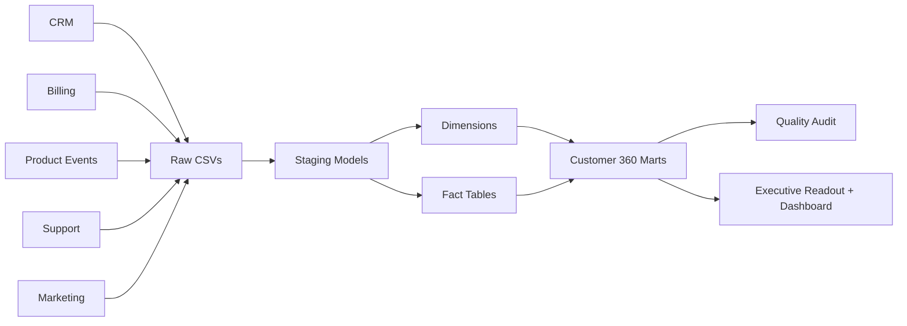

# Architecture

Customer Analytics Warehouse is a local analytics engineering project that turns messy SaaS source data into tested business marts.

## Layers

- `src/generate_data.py`: creates deterministic SaaS source systems with real operational messiness.
- `src/build_warehouse.py`: loads source CSVs into DuckDB and executes SQL models.
- `models/staging/`: cleans and normalizes raw tables.
- `models/dimensions/`: customer, account, date, and plan dimensions.
- `models/facts/`: usage, revenue, support, and opportunity facts.
- `models/marts/`: customer health, churn risk, revenue retention, product adoption, and account summary marts.
- `src/run_quality_checks.py`: validates sources and marts.
- `src/write_readout.py`: writes Markdown and dashboard artifacts.
